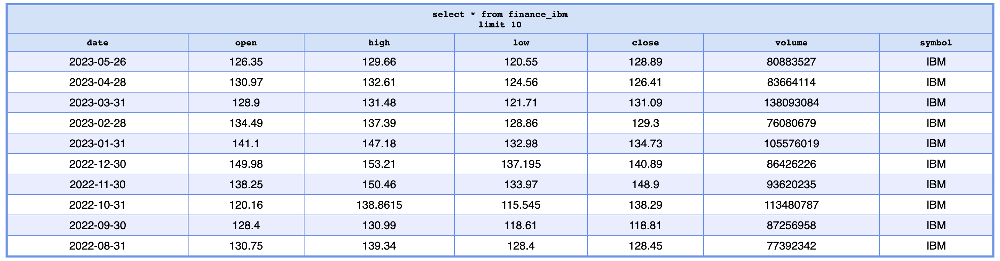

# Entregable 1
## Consigna
Desarrollar un script que extraiga datos de una API pública. A su vez, se debe crear una tabla en Redshift y cargar los datos extraídos.

## Desarrollo
Para el siguiente trabajo se extrajeron los datos de
[Alpha Vantage](https://www.alphavantage.co/) que proporciona datos del mercado financiero de nivel empresarial.

La extracción se realizó vía API y se tomaron los valores mensuales (último día de negociación de cada mes, apertura mensual, máximo mensual, mínimo mensual, cierre mensual, volumen mensual) de las acciones de IBM (IBM), APPLE (AAPL) y TESLA (TSLA), que cubre más de 20 años de datos históricos.

Luego se realizó la transformación de los datos y en última instancia se creó una tabla en Redshift y la posterior carga de los datos a la misma.

En la siguiente imagen se puede observar la salida de la tabla consultada desde Dbeaver.

